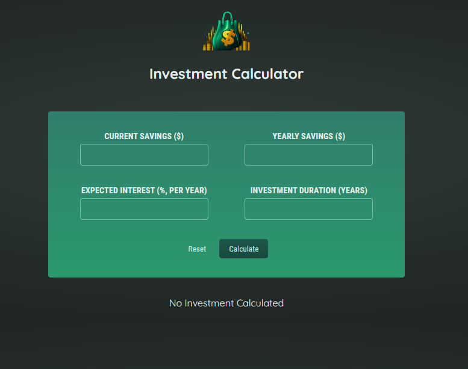
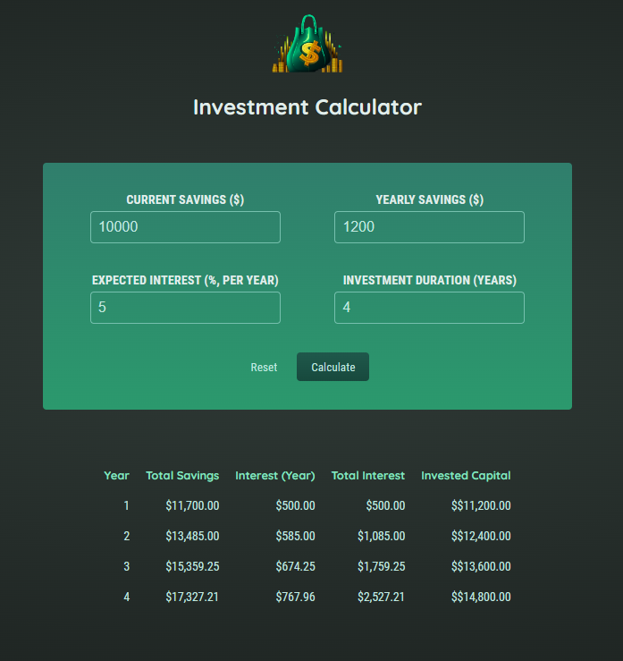

# **A simple to use Investment Calculator**

-------------

## Installation ⚙️

To install and run this application locally, follow these steps:

1. Clone the repository: `git clone https://github.com/Sammy970/Investment-Calculator-using-React`
2. Change to the project directory: `cd Investment-Calculator-using-React`
3. Install dependencies: `npm install`
4. Start the app: `npm start`

-------------

## Screenshot of the App

